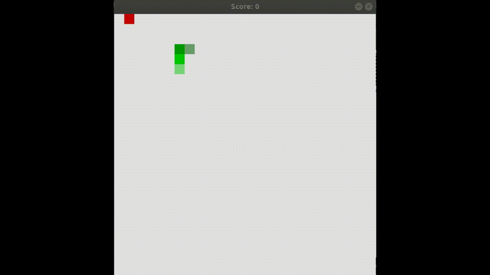
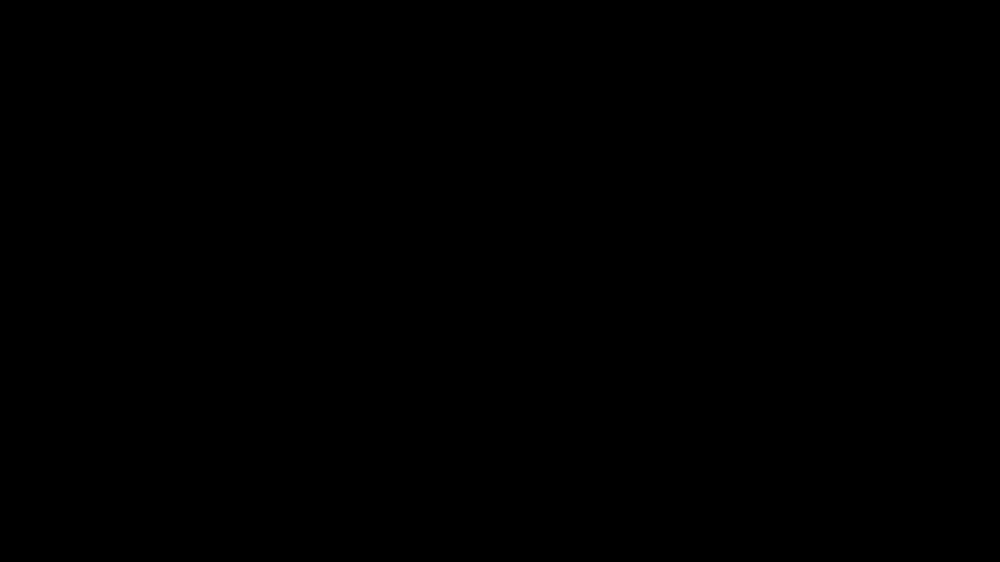
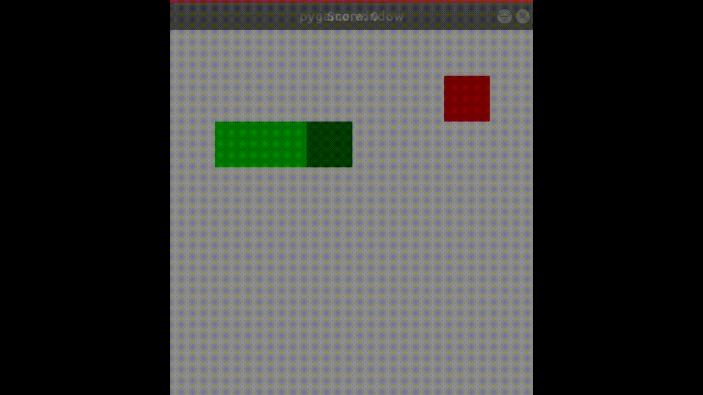
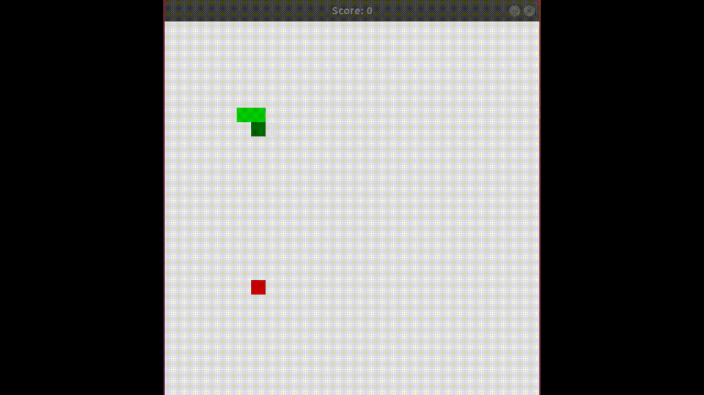

# Snake AI
Snake game agents implemented using:
- A* algorithm
- Reinforcement Learning (Q-learning)
- Monte Carlo Tree Search
- Reinforcement Learning and Monte Carlo Tree Search (Monte Carclo Q-learning)

### Requirements
- Python 3.6
- pygame library

### Start game

python snake.py -s \<size\> -a \<agent\>
 
 size:
 - xxs
 - xs
 - s
 - m
 - l
 
 agent:
 - random
 - zigzag
 - smart
 - oroborus
 - mc
 - q
 - mcq

### Random Agent
Agent that performs random actions.
>python snake.py -s m -a random

### Zigzag Agent
Agent that slowly approachs to food.
>python snake.py -s m -a zigzag

### Smart Agent
Agent uses A* algorithm.
>python snake.py -s m -a smart

### Oroborus Agent
[Snake](https://www.google.com/search?q=oroborus+snake&client=ubuntu&hs=deV&channel=fs&source=lnms&tbm=isch&sa=X&ved=0ahUKEwjJ5pfmto_cAhWFJFAKHZ-gDB4Q_AUICigB&biw=1366&bih=616#imgrc=BL2qng8gvHYcdM:) that chases its tail. Agent uses A* algorithm.
>python snake.py -s m -a oroborus

### Monte Carlo Agent
Agent uses Monte Carlo Tree Search algorithm. It works fine on small board, but it has some difficulties on big board.  
>python snake.py -s xs -a mc

>python snake.py -s m -a mc

### Q Agent
Agent uses Q-learning algorithm.
>python snake.py -s xxs -a q

### MCQ Agent
Agent uses Monte Carlo Q-learing algorithm.
>python snake.py -s xs -a mcq

